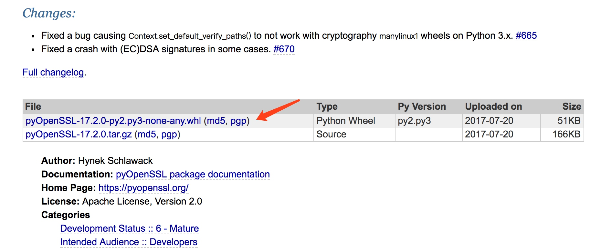
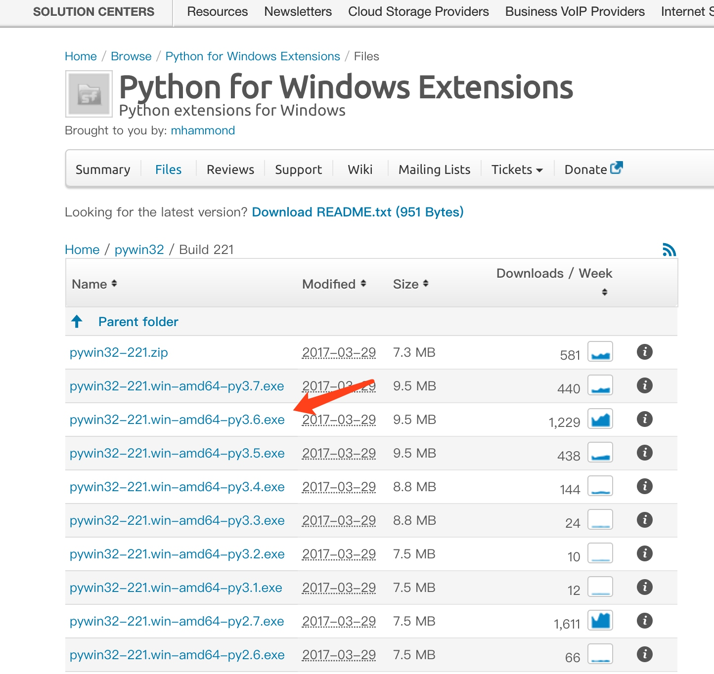
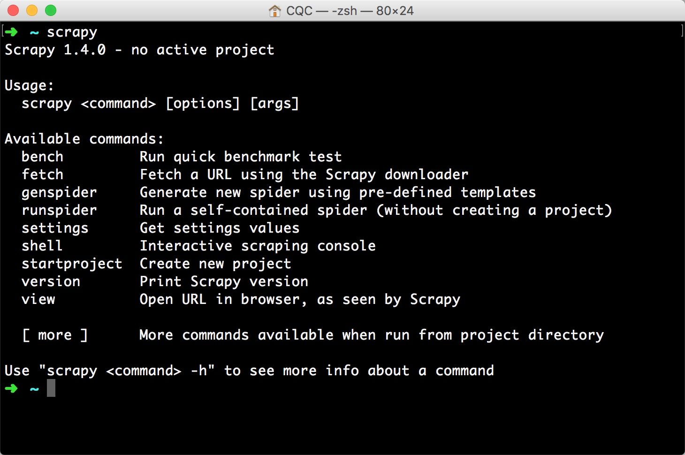

## 1.8 爬虫框架的安装

我们直接用 requests、Selenium
等库写爬虫，如果爬取量不是太大，速度要求不高，是完全可以满足需求的。但是写多了会发现其内部许多代码和组件是可以复用的，如果我们把这些组件抽离出来，将各个功能模块化，就慢慢会形成一个框架雏形，久而久之，爬虫框架就诞生了。

利用框架，我们可以不用再去关心某些功能的具体实现，只需要关心爬取逻辑即可。有了它们，可以大大简化代码量，而且架构也会变得清晰，爬取效率也会高许多。所以，如果有一定的基础，上手框架是一种好的选择。

本书主要介绍的爬虫框架有 pyspider 和 Scrapy。本节中，我们来介绍一下 pyspider、Scrapy 及其扩展库的安装方式。

### 1.8.1 pyspider 的安装

pyspider 是国人 binux 编写的强大的网络爬虫框架，它带有强大的 WebUI、脚本编辑器、任务监控器、项目管理器以及结果处理器，同时支持多种数据库后端、多种消息队列，另外还支持 JavaScript
渲染页面的爬取，使用起来非常方便，本节介绍一下它的安装过程。

#### 1. 相关链接

* 官方文档：[http://docs.pyspider.org/](http://docs.pyspider.org/)
* PyPi：[https://pypi.python.org/pypi/pyspider](https://pypi.python.org/pypi/pyspider)
* GitHub：[https://github.com/binux/pyspider](https://github.com/binux/pyspider)
* 官方教程：[http://docs.pyspider.org/en/latest/tutorial](http://docs.pyspider.org/en/latest/tutorial)
* 在线实例：[http://demo.pyspider.org](http://demo.pyspider.org)

#### 2. 准备工作

pyspider 是支持 JavaScript 渲染的，而这个过程是依赖于 PhantomJS 的，所以还需要安装 PhantomJS（具体的安装过程详见 1.2.5 节）。

#### 3. pip 安装

这里推荐使用 pip 安装，命令如下：

```
pip3 install pyspider
```

命令执行完毕即可完成安装。

#### 4. 常见错误

Windows 下可能会出现这样的错误提示：

```
Command"python setup.py egg_info"failed with error code 1 in /tmp/pip-build-vXo1W3/pycurl
```

这是 PyCurl 安装错误，此时需要安装 PyCurl
库。从 [http://www.lfd.uci.edu/~gohlke/pythonlibs/#pycurl](http://www.lfd.uci.edu/~gohlke/pythonlibs/#pycurl) 找到对应的 Python
版本，然后下载相应的 wheel 文件即可。比如 Windows 64 位、Python 3.6，则需要下载 pycurl-7.43.0-cp36-cp36m-win_amd64.whl，随后用 pip 安装即可，命令如下：

```
pip3 install pycurl-7.43.0-cp36-cp36m-win_amd64.whl
```

如果在 Linux 下遇到 PyCurl 的错误，可以参考本文：[https://imlonghao.com/19.html](https://imlonghao.com/19.html)。

#### 5. 验证安装

安装完成之后，可以直接在命令行下启动 pyspider：

```
pyspider all
```

此时控制台会有类似如图 1-74 所示的输出。


图 1-74 控制台

这时 pyspider 的 Web 服务就会在本地 5000 端口运行。直接在浏览器中打开 [http://localhost:5000/](http://localhost:5000/)，即可进入 pyspider 的 WebUI
管理页面，如图 1-75 所示，这证明 pyspider 已经安装成功了。


图 1-75 管理页面

后面，我们会详细介绍 pyspider 的用法。

### 1.8.2 Scrapy 的安装

Scrapy 是一个十分强大的爬虫框架，依赖的库比较多，至少需要依赖的库有 Twisted 14.0、lxml 3.4 和 pyOpenSSL
0.14。在不同的平台环境下，它所依赖的库也各不相同，所以在安装之前，最好确保把一些基本库安装好。本节就来介绍 Scrapy 在不同平台的安装方法。

#### 1. 相关链接

* 官方网站：[https://scrapy.org](https://scrapy.org)
* 官方文档：[https://docs.scrapy.org](https://docs.scrapy.org)
* PyPi：[https://pypi.python.org/pypi/Scrapy](https://pypi.python.org/pypi/Scrapy)
* GitHub：[https://github.com/scrapy/scrapy](https://github.com/scrapy/scrapy)
* 中文文档：[http://scrapy-chs.readthedocs.io](http://scrapy-chs.readthedocs.io)

#### 2. Anaconda 安装

这是一种比较简单的安装 Scrapy 的方法（尤其是对于 Windows 来说），如果你的 Python 是使用 Anaconda 安装的，或者还没有安装 Python 的话，可以使用此方法安装，这种方法简单、省力。当然，如果你的
Python 不是通过 Anaconda 安装的，可以继续看后面的内容。

关于 Anaconda 的安装方式，可以查看 1.1 节，在此不再赘述。

如果已经安装好了 Anaconda，那么可以通过 conda 命令安装 Scrapy，具体如下：

```
conda install Scrapy
```

#### 3. Windows 下的安装

如果你的 Python 不是使用 Anaconda 安装的，可以参考如下方式来一步步安装 Scrapy。

##### 安装 lxml

lxml 的安装过程请参见 1.3.1 节，在此不再赘述，此库非常重要，请一定要安装成功。

##### 安装 pyOpenSSL

在官方网站下载 wheel
文件（详见 [https://pypi.python.org/pypi/pyOpenSSL#downloads](https://pypi.python.org/pypi/pyOpenSSL#downloads)）即可，如图 1-76
所示。



图 1-76 下载页面

下载后利用 pip 安装即可：

```
pip3 install pyOpenSSL-17.2.0-py2.py3-none-any.whl
```

##### 安装 Twisted

到 [http://www.lfd.uci.edu/~gohlke/pythonlibs/#twisted](http://www.lfd.uci.edu/~gohlke/pythonlibs/#twisted) 下载 wheel
文件，利用 pip 安装即可。

比如，对于 Python 3.6 版本、Windows 64 位系统，则当前最新版本为 Twisted-17.5.0-cp36-cp36m-  
win_amd64.whl，直接下载即可，如图 1-77 所示。


图 1-77 下载页面

然后通过 pip 安装：

```
pip3 install Twisted-17.5.0-cp36-cp36m-win_amd64.whl
```

##### 安装 PyWin32

从官方网站下载对应版本的安装包即可，链接为：[https://sourceforge.net/projects/pywin32/files/pywin32/Build%20221/](https://sourceforge.net/projects/pywin32/files/pywin32/Build%20221/)，如图
1-78 所示。



图 1-78 下载列表

比如对于 Python 3.6 版本，可以选择下载 pywin32-221.win-amd64-py3.6.exe，下载完毕之后双击安装即可。

注意，这里使用的是 Build 221
版本，随着时间推移，版本肯定会继续更新，最新的版本可以查看 [https://sourceforge.net/projects/pywin32/files/pywin32/](https://sourceforge.net/projects/pywin32/files/pywin32/)，到时查找最新的版本安装即可。

##### 安装 Scrapy

安装好了以上的依赖库后，安装 Scrapy 就非常简单了，这里依然使用 pip，命令如下：

```
pip3 install Scrapy
```

等待命令结束，如果没有报错，就证明 Scrapy 已经安装好了。

#### 4. Linux 下的安装

在 Linux 下的安装方式依然分为两类平台来介绍。

##### CentOS 和 Red Hat

在 CentOS 和 Red Hat 下，首先确保一些依赖库已经安装，运行如下命令：

```
sudo yum groupinstall -y development tools  
sudo yum install -y epel-release libxslt-devel libxml2-devel openssl-devel
```

最后利用 pip 安装 Scrapy 即可：

```
pip3 install Scrapy
```

##### Ubuntu、Debian 和 Deepin

在 Ubuntu、Debian 和 Deepin 平台下，首先确保一些依赖库已经安装，运行如下命令：

```
sudo apt-get install build-essential python3-dev libssl-dev libffi-dev libxml2 libxml2-dev libxslt1-dev zlib1g-dev
```

然后利用 pip 安装 Scrapy 即可：

```
pip3 install Scrapy
```

运行完毕后，就完成 Scrapy 的安装了。

#### 5. Mac 下的安装

在 Mac 下，首先也是进行依赖库的安装。

在 Mac 上构建 Scrapy 的依赖库需要 C 编译器以及开发头文件，它一般由 Xcode 提供，具体命令如下：

```
xcode-select --install
```

随后利用 pip 安装 Scrapy 即可：

```
pip3 install Scrapy
```

#### 6. 验证安装

安装之后，在命令行下输入 scrapy，如果出现类似如图 1-79 所示的结果，就证明 Scrapy 安装成功了。



图 1-79 验证安装

#### 7. 常见错误

在安装过程中，常见的错误汇总如下。

##### pkg_resources.VersionConflict: (six 1.5.2 (/usr/lib/python3/dist-packages), Requirement.parse('six&gt;=1.6.0'))

这是 six 包版本过低出现的错误。six 包是一个提供兼容 Python 2 和 Python 3 的库，这时升级 six 包即可：

```
sudo pip3 install -U six
```

##### c/_cffi_backend.c:15:17: fatal error: ffi.h: No such file or directory

这是在 Linux 下常出现的错误，缺少 libffi 库造成的。什么是 libffi？FFI 的全名是 Foreign Function Interface，通常指的是允许以一种语言编写的代码调用另一种语言的代码。而 libffi
库只提供了最底层的、与架构相关的、完整的 FFI。此时安装相应的库即可。

在 Ubuntu 和 Debian 下，直接执行如下命令即可：

```
sudo apt-get install build-essential libssl-dev libffi-dev python3-dev
```

在 CentOS 和 Red Hat 下，直接执行如下命令即可：

```
sudo yum install gcc libffi-devel python-devel openssl-devel
```

##### Command "python setup.py egg_info" failed with error code 1 in /tmp/pip-build/cryptography/

这是缺少加密的相关组件，此时利用 pip 安装即可：

```
pip3 install cryptography
```

##### ImportError: No module named 'packaging'

这是因为缺少 packaging 包出现的错误，这个包提供了 Python 包的核心功能，此时利用 pip 安装即可：

```
pip3 install packaging
```

##### ImportError: No module named '_cffi_backend'

这个错误表示缺少 cffi 包，直接使用 pip 安装即可：

```
pip3 install cffi
```

##### ImportError: No module named 'pyparsing'

这个错误表示缺少 pyparsing 包，直接使用 pip 安装即可：

```
pip3 install pyparsing appdirs
```

### 1.8.3 Scrapy-Splash 的安装

Scrapy-Splash 是一个 Scrapy 中支持 JavaScript 渲染的工具，本节来介绍它的安装方式。

Scrapy-Splash 的安装分为两部分。一个是 Splash 服务的安装，具体是通过 Docker，安装之后，会启动一个 Splash 服务，我们可以通过它的接口来实现 JavaScript 页面的加载。另外一个是
Scrapy-Splash 的 Python 库的安装，安装之后即可在 Scrapy 中使用 Splash 服务。

#### 1. 相关链接

* GitHub：[https://github.com/scrapy-plugins/scrapy-splash](https://github.com/scrapy-plugins/scrapy-splash)
* PyPi：[https://pypi.python.org/pypi/scrapy-splash](https://pypi.python.org/pypi/scrapy-splash)
*

使用说明：[https://github.com/scrapy-plugins/scrapy-splash#configuration](https://github.com/scrapy-plugins/scrapy-splash#configuration)

* Splash 官方文档：[http://splash.readthedocs.io](http://splash.readthedocs.io)

#### 2. 安装 Splash

Scrapy-Splash 会使用 Splash 的 HTTP API 进行页面渲染，所以我们需要安装 Splash 来提供渲染服务。这里通过 Docker 安装，在这之前请确保已经正确安装好了 Docker。

安装命令如下：

```
docker run -p 8050:8050 scrapinghub/splash
```

安装完成之后，会有类似的输出结果：

```
2017-07-03 08:53:28+0000 [-] Log opened.  
2017-07-03 08:53:28.447291 [-] Splash version: 3.0  
2017-07-03 08:53:28.452698 [-] Qt 5.9.1, PyQt 5.9, WebKit 602.1, sip 4.19.3, Twisted 16.1.1, Lua 5.2  
2017-07-03 08:53:28.453120 [-] Python 3.5.2 (default, Nov 17 2016, 17:05:23) [GCC 5.4.0 20160609]  
2017-07-03 08:53:28.453676 [-] Open files limit: 1048576  
2017-07-03 08:53:28.454258 [-] Can't bump open files limit  
2017-07-03 08:53:28.571306 [-] Xvfb is started: ['Xvfb', ':1599197258', '-screen', '0', '1024x768x24',   
    '-nolisten', 'tcp']  
QStandardPaths: XDG_RUNTIME_DIR not set, defaulting to '/tmp/runtime-root'  
2017-07-03 08:53:29.041973 [-] proxy profiles support is enabled, proxy profiles path:   
    /etc/splash/proxy-profiles  
2017-07-03 08:53:29.315445 [-] verbosity=1  
2017-07-03 08:53:29.315629 [-] slots=50  
2017-07-03 08:53:29.315712 [-] argument_cache_max_entries=500  
2017-07-03 08:53:29.316564 [-] Web UI: enabled, Lua: enabled (sandbox: enabled)  
2017-07-03 08:53:29.317614 [-] Site starting on 8050  
2017-07-03 08:53:29.317801 [-] Starting factory &lt;twisted.web.server.Site object at 0x7ffaa4a98cf8&gt;
```

这样就证明 Splash 已经在 8050 端口上运行了。这时我们打开 [http://localhost:8050](http://localhost:8050)，即可看到 Splash 的主页，如图 1-80 所示。


图 1-80 运行页面

当然，Splash 也可以直接安装在远程服务器上。我们在服务器上以守护态运行 Splash 即可，命令如下：

```
docker run -d -p 8050:8050 scrapinghub/splash
```

这里多了 -d 参数，它代表将 Docker 容器以守护态运行，这样在中断远程服务器连接后，不会终止 Splash 服务的运行。

#### 3. Scrapy-Splash 的安装

成功安装 Splash 之后，接下来再来安装其 Python 库，命令如下：

```
pip3 install scrapy-splash
```

命令运行完毕后，就会成功安装好此库，后面会详细介绍它的用法。

### 1.8.4 Scrapy-Redis 的安装

Scrapy-Redis 是 Scrapy 的分布式扩展模块，有了它，我们就可以方便地实现 Scrapy 分布式爬虫的搭建。本节中，我们将介绍 Scrapy-Redis 的安装方式。

#### 1. 相关链接

* GitHub：[https://github.com/rmax/scrapy-redis](https://github.com/rmax/scrapy-redis)
* PyPi：[https://pypi.python.org/pypi/scrapy-redis](https://pypi.python.org/pypi/scrapy-redis)
* 官方文档：[http://scrapy-redis.readthedocs.io](http://scrapy-redis.readthedocs.io)

#### 2. pip 安装

这里推荐使用 pip 安装，命令如下：

```
pip3 install scrapy-redis
```

#### 3. wheel 安装

此外，也可以到 PyPI 下载 wheel文件安装（详见 [https://pypi.python.org/pypi/scrapy-redis#downloads](https://pypi.python.org/pypi/scrapy-redis#downloads)），如当前的最新版本为
0.6.8，则可以下载 scrapy_redis-0.6.8-py2.py3-none-any.whl，然后通过 pip 安装即可：

```
pip3 install scrapy_redis-0.6.8-py2.py3-none-any.whl
```

#### 4. 测试安装

安装完成之后，可以在 Python 命令行下测试：

```
$ python3
>>> import scrapy_redis
```

如果没有错误报出，则证明库已经安装好了。