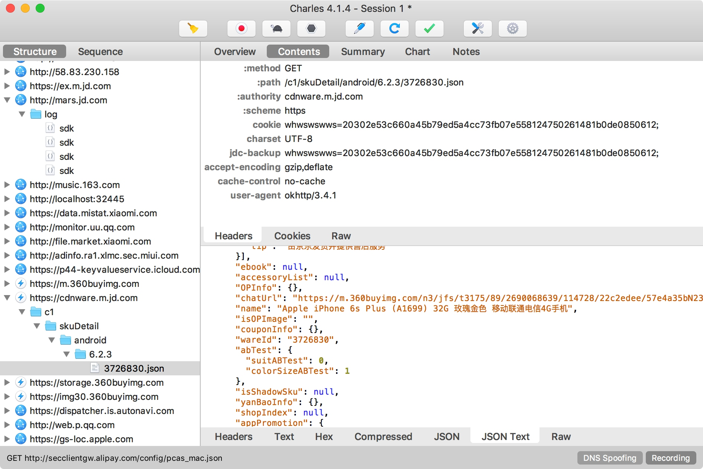
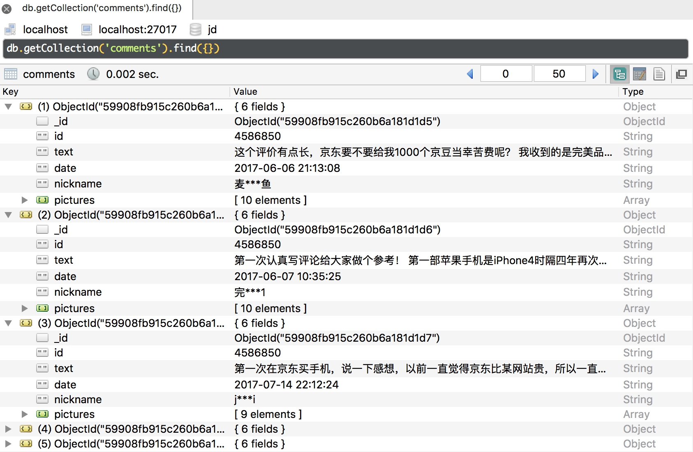

# 11.6 Appium+mitmdump 爬取京东商品

在前文中，我们曾经用 Charles 分析过京东商品的评论数据，但是可以发现其参数相当复杂，Form 表单有很多加密参数。如果我们只用 Charles
探测到这个接口链接和参数，还是无法直接构造请求的参数，构造的过程涉及一些加密算法，也就无法直接还原抓取过程。

我们了解了 mitmproxy 的用法，利用它的 mitmdump 组件，可以直接对接 Python 脚本对抓取的数据包进行处理，用 Python
脚本对请求和响应直接进行处理。这样我们可以绕过请求的参数构造过程，直接监听响应进行处理即可。但是这个过程并不是自动化的，抓取 App 的时候实际是人工模拟了这个拖动过程。如果这个操作可以用程序来实现就更好了。

我们又了解了 Appium 的用法，它可以指定自动化脚本模拟实现 App 的一系列动作，如点击、拖动等，也可以提取 App
中呈现的信息。经过上节爬取微信朋友圈的实例，我们知道解析过程比较烦琐，而且速度要加以限制。如果内容没有显示出来解析就会失败，而且还会导致重复提取的问题。更重要的是，它只可以获取在 App
中看到的信息，无法直接提取接口获取的真实数据，而接口的数据往往是最易提取且信息量最全的。

综合以上几点，我们就可以确定出一个解决方案了。如果我们用 mitmdump 去监听接口数据，用 Appium 去模拟 App 的操作，就可以绕过复杂的接口参数又可以实现自动化抓取了！这种方式应是抓取 App
数据的最佳方式。某些特殊情况除外，如微信朋友圈数据又经过了一次加密无法解析，而只能用 Appium 提取。但是对于大多数 App 来说，此种方法是奏效的。本节我们用一个实例感受一下这种抓取方式的便捷之处。

### 1. 本节目标

以抓取京东 App 的商品信息和评论为例，实现 Appium 和 mitmdump 二者结合的抓取。抓取的数据分为两部分：一部分是商品信息，我们需要获取商品的
ID、名称和图片，将它们组成一条商品数据；另一部分是商品的评论信息，我们将评论人的昵称、评论正文、评论日期、发表图片都提取，然后加入商品 ID 字段，将它们组成一条评论数据。最后数据保存到 MongoDB 数据库。

### 2. 准备工作

请确保 PC 已经安装好 Charles、mitmdump、Appium、Android 开发环境，以及 Python 版本的 Appium API。Android 手机安装好京东 App。另外，安装好 MongoDB 并运行其服务，安装
PyMongo 库。具体的配置过程可以参考第 1 章。

### 3. Charles 抓包分析

首先，我们将手机代理设置到 Charles 上，用 Charles 抓包分析获取商品详情和商品评论的接口。

获取商品详情的接口，这里提取到的接口是来自 cdnware.m.jd.com 的链接，返回结果是一个 JSON 字符串，里面包含了商品的 ID 和商品名称，如图 11-47 和图 11-48 所示。


图 11-47 请求概览



图 11-48 响应结果

再获取商品评论的接口，这个过程在前文已提到，在此不再赘述。这个接口来自 api.m.jd.com，返回结果也是 JSON 字符串，里面包含了商品的数条评论信息。

之后我们可以用 mitmdump 对接一个 Python 脚本来实现数据的抓取。

### 4. mitmdump 抓取

新建一个脚本文件，然后实现这个脚本以提取这两个接口的数据。首先提取商品的信息，代码如下所示：

```python
def response(flow):
    url = 'cdnware.m.jd.com'
    if url in flow.request.url:
        text = flow.response.text
        data = json.loads(text)
        if data.get('wareInfo') and data.get('wareInfo').get('basicInfo'):
            info = data.get('wareInfo').get('basicInfo')
            id = info.get('wareId')
            name = info.get('name')
            images = info.get('wareImage')
            print(id, name, images)
```

这里声明了接口的部分链接内容，然后与请求的 URL 作比较。如果该链接出现在当前的 URL 中，那就证明当前的响应就是商品详情的响应，然后提取对应的 JSON 信息即可。在这里我们将商品的 ID、名称和图片提取出来，这就是一条商品数据。

再提取评论的数据，代码实现如下所示：

```python
# 提取评论数据
url = 'api.m.jd.com/client.action'
if url in flow.request.url:
    pattern = re.compile('sku\".*?\"(\d+)\"')
    # Request 请求参数中包含商品 ID
    body = unquote(flow.request.text)
    # 提取商品 ID
    id = re.search(pattern, body).group(1) if re.search(pattern, body) else None
    # 提取 Response Body
    text = flow.response.text
    data = json.loads(text)
    comments = data.get('commentInfoList') or []
    # 提取评论数据
    for comment in comments:
        if comment.get('commentInfo') and comment.get('commentInfo').get('commentData'):
            info = comment.get('commentInfo')
            text = info.get('commentData')
            date = info.get('commentDate')
            nickname = info.get('userNickName')
            pictures = info.get('pictureInfoList')
            print(id, nickname, text, date, pictures)
```

这里指定了接口的部分链接内容，以判断当前请求的 URL 是不是获取评论的 URL。如果满足条件，那么就提取商品的 ID 和评论信息。

商品的 ID 实际上隐藏在请求中，我们需要提取请求的表单内容来提取商品的 ID，这里直接用了正则表达式。

商品的评论信息在响应中，我们像刚才一样提取了响应的内容，然后对 JSON 进行解析，最后提取出商品评论人的昵称、评论正文、评论日期和图片信息。这些信息和商品的 ID 组合起来，形成一条评论数据。

最后用 MongoDB 将两部分数据分开保存到两个 Collection，在此不再赘述。

运行此脚本，命令如下所示：

```
mitmdump -s script.py
```

手机的代理设置到 mitmdump 上。我们在京东 App 中打开某个商品，下拉商品评论部分，即可看到控制台输出两部分的抓取结果，结果成功保存到 MongoDB 数据库，如图 11-49 所示。



图 11-49 保存结果

如果我们手动操作京东 App 就可以做到京东商品评论的抓取了，下一步要做的就是实现自动滚动刷新。

### 5. Appium 自动化

将 Appium 对接到手机上，用 Appium 驱动 App 完成一系列动作。进入 App 后，我们需要做的操作有点击搜索框、输入搜索的商品名称、点击进入商品详情、进入评论页面、自动滚动刷新，基本的操作逻辑和爬取微信朋友圈的相同。

京东 App 的 Desired Capabilities 配置如下所示：

```python
{
    'platformName': 'Android',
    'deviceName': 'MI_NOTE_Pro',
    'appPackage': 'com.jingdong.app.mall',
    'appActivity': 'main.MainActivity'
}
```

首先用 Appium 内置的驱动打开京东 App，如图 11-50 所示。


图 11-50 调试界面

这里进行一系动作操作并录制下来，找到各个页面的组件的 ID 并做好记录，最后再改写成完整的代码。参考代码实现如下所示：

```python
from appium import webdriver
from selenium.webdriver.common.by import By
from selenium.webdriver.support.ui import WebDriverWait
from selenium.webdriver.support import expected_conditions as EC
from time import sleep

class Action():
    def __init__(self):
        # 驱动配置
        self.desired_caps = {
            'platformName': PLATFORM,
            'deviceName': DEVICE_NAME,
            'appPackage': 'com.jingdong.app.mall',
            'appActivity': 'main.MainActivity'
        }
        self.driver = webdriver.Remote(DRIVER_SERVER, self.desired_caps)
        self.wait = WebDriverWait(self.driver, TIMEOUT)
    
    def comments(self):
        # 点击进入搜索页面
        search = self.wait.until(EC.presence_of_element_located((By.ID, 'com.jingdong.app.mall:id/mp')))
        search.click()
        # 输入搜索文本
        box = self.wait.until(EC.presence_of_element_located((By.ID, 'com.jd.lib.search:id/search_box_layout')))
        box.set_text(KEYWORD)
        # 点击搜索按钮
        button = self.wait.until(EC.presence_of_element_located((By.ID, 'com.jd.lib.search:id/search_btn')))
        button.click()
        # 点击进入商品详情
        view = self.wait.until(EC.presence_of_element_located((By.ID, 'com.jd.lib.search:id/product_list_item')))
        view.click()
        # 进入评论详情
        tab = self.wait.until(EC.presence_of_element_located((By.ID, 'com.jd.lib.productdetail:id/pd_tab3')))
        tab.click()
    
    def scroll(self):
        while True:
            # 模拟拖动
            self.driver.swipe(FLICK_START_X, FLICK_START_Y + FLICK_DISTANCE, FLICK_START_X, FLICK_START_Y)
            sleep(SCROLL_SLEEP_TIME)
    
    def main(self):
        self.comments()
        self.scroll()

if __name__ == '__main__':
    action = Action()
    action.main()
```

代码实现比较简单，逻辑与上一节微信朋友圈的抓取类似。注意，由于 App 版本更新的原因，交互流程和元素 ID 可能有更改，这里的代码仅做参考。

下拉过程已经省去了用 Appium 提取数据的过程，因为这个过程我们已经用 mitmdump 帮助实现了。

代码运行之后便会启动京东 App，进入商品的详情页，然后进入评论页再无限滚动，这样就代替了人工操作。Appium 实现模拟滚动，mitmdump 进行抓取，这样 App 的数据就会保存到数据库中。

### 6. 本节代码

本节代码地址：[https://github.com/Python3WebSpider/MitmAppiumJD](https://github.com/Python3WebSpider/MitmAppiumJD)。

### 7. 结语

以上内容便是 Appium 和 mitmdump 抓取京东 App 数据的过程。有了两者的配合，我们既可以做到实时数据处理，又可以实现自动化爬取，这样就可以完成绝大多数 App 的爬取了。